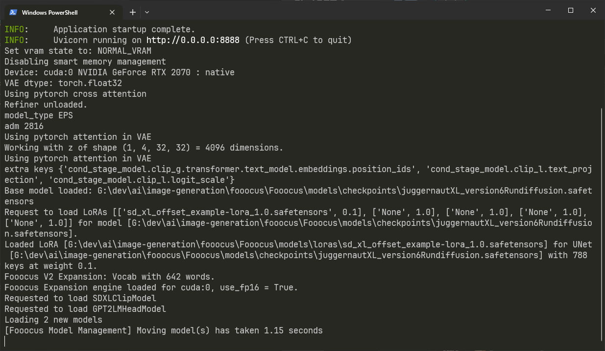

# fooocos-telegram-bot


#### ⚠️ The project may contain some bugs and errors, provided as is

Dynamic inline bot leveraging the robust capabilities of Fooocos for image generation. This bot integrates seamlessly with Telegram, offering an intuitive and engaging user experience.

Current [FooocosAPI](https://github.com/konieshadow/Fooocus-API/tree/bf2f2c745a159e13b8de93fd000470ed98c973c4) commit hash: `bf2f2c745a159e13b8de93fd000470ed98c973c4`

> Mirror on my [ Git](https://git.zeldon.ru/zeldon/fooocos-telegram-bot.git)

# Getting Started

## System Requirements
Before diving in, ensure your system meets these prerequisites:

- Git
- Python >= 3.10
- NodeJS >= 20
- An Nvidia GPU with a minimum of 4GB VRAM (other GPUs may be supported; check the [official Fooocos repository](https://github.com/konieshadow/Fooocus-API) for details).

## Installation Guide for Windows

> This guide for **Windows** only, but for Linux the logic is exactly the same, but the commands may be slightly different

### Install the correct FooocosAPI version locally:

1. Clone the FooocosAPI repository:

```bash
git clone https://github.com/konieshadow/Fooocus-API/tree/bf2f2c745a159e13b8de93fd000470ed98c973c4
```
2. Navigate to the cloned directory:

```bash
cd Fooocus-API
```
3. Create and activate a Python virtual environment:

```bash
python -m venv venv
.\venv\Scripts\activate
```

4. Install requirements:

```bash
pip install -r requirements.txt
```
5. Launch FooocosAPI:

```bash
python .\main.py --host 0.0.0.0
```
If successful, you should see output similar to this:



For subsequent runs, simply activate the virtual environment and start the API:

```bash
.\venv\Scripts\activate
python .\main.py --host 0.0.0.0
```

> Tip: You can also try the [latest FooocosAPI version](https://github.com/konieshadow/Fooocus-API), but you might need to copy and replace openapi.json from `http://localhost:8888/openapi.json` (default) to `fooocos` directory, regenerate the client (`npm run fooocos:typegen`) and address any possible TypeScript compiler errors.

### Setting Up the Bot:

1. Clone this repository

```bash
git clone https://github.com/xzeldon/fooocos-telegram-bot.git
```

2. Install dependencies:

```bash
npm i
```

3. Prepare your configuration file:

- Duplicate the `.env.sample` file and rename it to `.env`.
- Edit the `.env` file with your specific details as per the table below:

<table>
<thead>
  <tr>
    <th>Variable</th>
    <th>Type</th>
    <th>Description</th>
  </tr>
</thead>
<tbody>
  <tr>
    <td>NODE_ENV</td>
    <td>String</td>
    <td>Specifies the application environment. (<code>development</code> or <code>production</code>)</td>
  </tr>
  <tr>
    <td>BOT_TOKEN</td>
    <td>
        String
    </td>
    <td>
        Telegram Bot API token obtained from <a href="https://t.me/BotFather">@BotFather</a>.
    </td>
  </tr>
  <tr>
    <td>FOOOCOS_API_URL</td>
    <td>String</td>
    <td>URL of the Fooocos-API endpoint.</td>
  </tr>
  <tr>
    <td>DUMMY_CHAT_ID</td>
    <td>String</td>
    <td>ID of a dummy chat for uploading images to retrieve their file_id for inline message editing.</td>
  </tr>
</tbody>
</table>

4. Start the bot:

    - For development with hot reload:
        ```bash
        npm run dev
        ```

    - For standard operation:
        ```bash
        npm run start
        ```

# License
This project is open-source, licensed under the MIT License. Feel free to use, modify, and distribute it as you see fit.